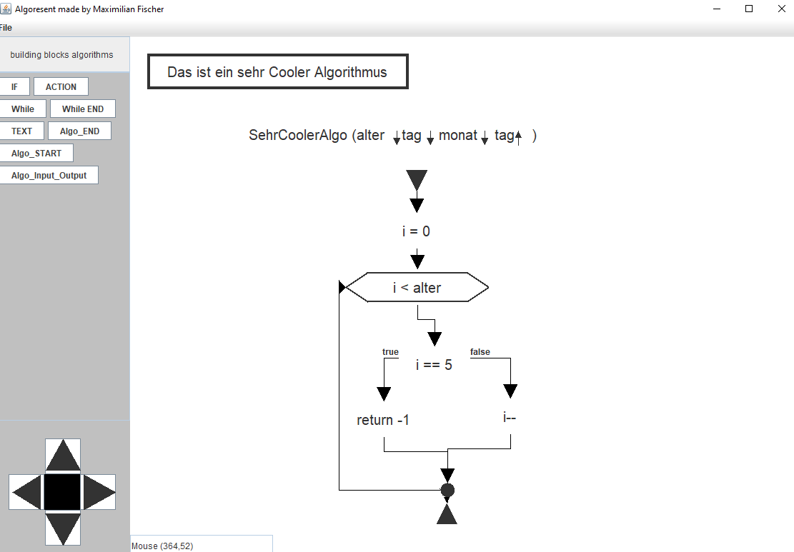
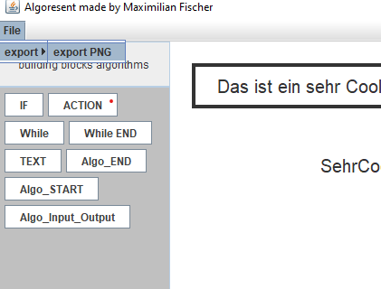

# Algoresent

This Progamm is capable of creating flow charts 
This Project was made in 2019

- Motivation
- Description
- Learnings
- External Tools

## Motivation
This Project was done for fun and to improve my java skills.

## Description

Flow charts are used to represent algorithms without code. Algoresent, this Programm, allows the user to create those diagramms on the computer easily.

The building blocks of algorithms can be placed via drag and drop.
And connected by clicking on the arrow connection points.

The Algorihmus can be exported as an png.  

)

## Learnings

- heredity in java 
- java swing
- perseverance

## External Tools
- java swing
- java awt
